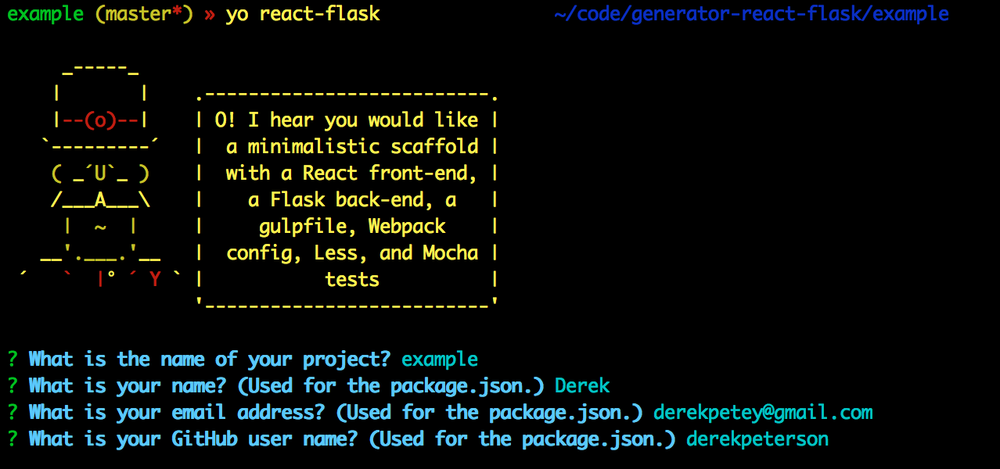

# generator-react-flask

**DEPRECATED**

This project is deprecated. You shouldn't use it.

---

[](https://travis-ci.org/derekpeterson/generator-react-flask)

[](https://nodei.co/npm/generator-react-flask/)

This generator gives you a minimalistic skeleton for a React app with a Flask API, including build scripts, linting, and tests. Just enough to get you started, without a bunch of bloat that you'll end up deleting.

## Usage

Install Yeoman and the generator globally:

```javascript
npm install -g yo generator-react-flask
```

Run the generator with Yeoman:

```bash
yo react-flask
```



The generator asks you for the project name, your name, your email address,
and your GitHub user name. It uses these to configure the generated files, not
for anything creepy.

After it's done, it will run `npm install` unless you ran the generator with
`--skip-install`. For the Flask part, you'll run these three
commands to create your virtual environment, activate it, and install the
dependencies:

```bash
pyvenv env
source env/bin/activate
pip install -r requirements.txt
```

Once you have everything installed, you can start your app with `npm run app`.
Check out `package.json` and `gulpfile.js` to see which tasks are included by
default.
